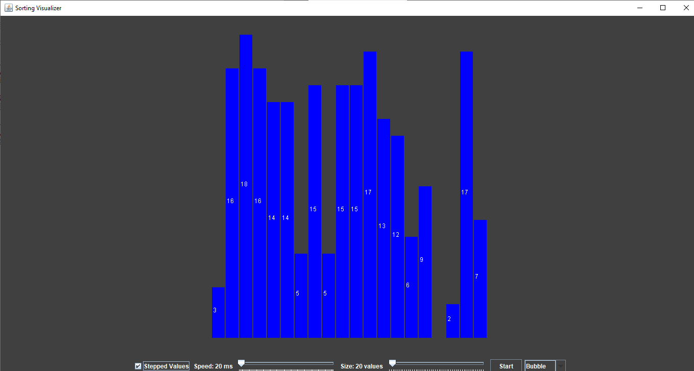
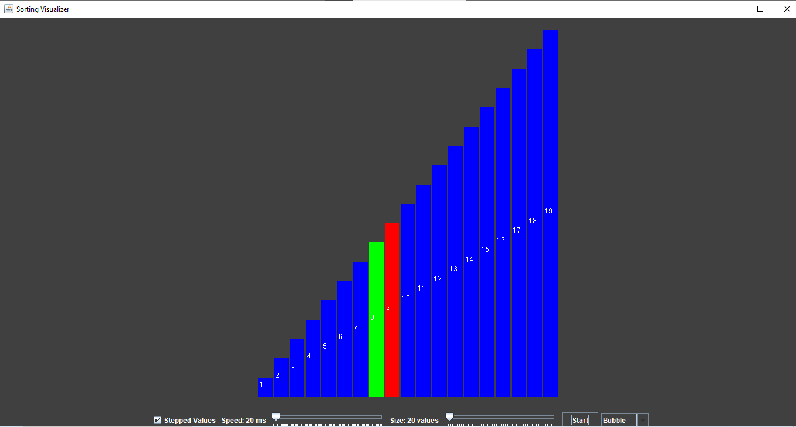

# Sorting Visualizer

Welcome to the Sorting Visualizer! This application provides a visual representation of various sorting algorithms including Bubble Sort, Quick Sort, Selection Sort, Merge Sort, and Insertion Sort. This tool is useful for understanding how these algorithms work and how they differ from each other.

## Features

- Visualize the process of Bubble Sort, Quick Sort, Selection Sort, Merge Sort, and Insertion Sort
- Adjustable speed to control the visualization pace
- Step-by-step execution to closely follow each algorithm's process
- User-friendly interface

## Screenshots

### Main Interface


### Sorting Visualization


## Getting Started

To get a local copy up and running, follow these simple steps.

### Prerequisites

- Make sure you have NetBeans IDE installed. You can download it from [netbeans.org](https://netbeans.org/).
- Ensure you have the Java Development Kit (JDK) installed. You can download it from [oracle.com](https://www.oracle.com/java/technologies/javase-downloads.html).

### Installation

1. Clone the repo
   ```sh
   git clone https://github.com/akoraishi2000/Sorting-Visualizer.git
   ```
2. Open NetBeans IDE.
3. Select `File -> Open Project` and navigate to the cloned repository.
4. Select the `Sorting-Visualizer` project and open it.

## Usage

1. Once the project is open in NetBeans, right-click on the project name in the Projects panel.
2. Select `Run` to compile and start the application.
3. In the application window, select the sorting algorithm you want to visualize from the dropdown menu.
4. Adjust the speed of the visualization using the speed slider.
5. Click on the "Start" button to begin the visualization.
6. You can pause the visualization at any time by clicking on the "Pause" button.

## Contributing

Contributions are what make the open source community such an amazing place to learn, inspire, and create. Any contributions you make are **greatly appreciated**.

1. Fork the Project
2. Create your Feature Branch (`git checkout -b feature/AmazingFeature`)
3. Commit your Changes (`git commit -m 'Add some AmazingFeature'`)
4. Push to the Branch (`git push origin feature/AmazingFeature`)
5. Open a Pull Request

## License

Distributed under the MIT License. See `LICENSE` for more information.

## Contact

Project Link: [https://github.com/akoraishi2000/Sorting-Visualizer](https://github.com/akoraishi2000/Sorting-Visualizer)
